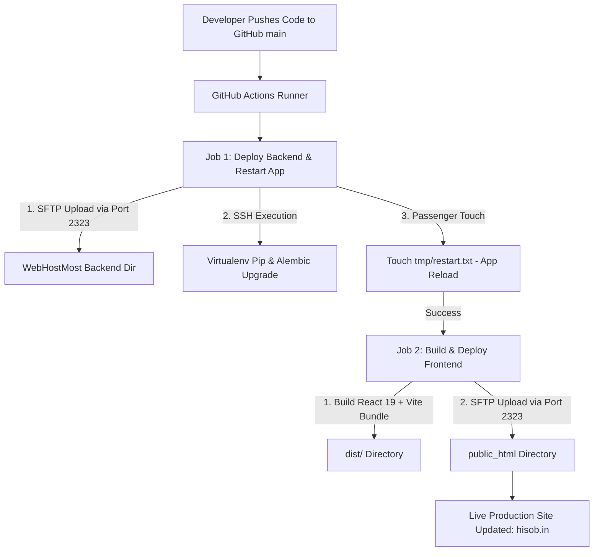

# Hisob ERP — Automated CI/CD Deployment Guide (WebHostMost Shared Hosting)

This guide documents the complete end-to-end **Automated CI/CD Deployment Pipeline** established for **Hisob ERP** connecting GitHub Actions to **WebHostMost Shared Hosting** (`server3.webhostmost.com`).

---

## 🏗️ Architecture & Workflow Overview

The CI/CD pipeline is defined in [`.github/workflows/deploy.yml`](file:///d:/2026/Hissob%20FastAPI/Hissob-app/.github/workflows/deploy.yml). It automatically triggers on every `git push` to the `main` branch.



---

## 📌 WebHostMost Server Infrastructure Specifications

| Specification | Value | Description |
| :--- | :--- | :--- |
| **Server Hostname** | `server3.webhostmost.com` | Primary host server address |
| **Server IP Address** | `66.78.59.15` | Dedicated server IP |
| **System Username** | `qhmwlequ` | Master cPanel / SSH / SFTP account user |
| **sFTP Port** | `2323` | Official WebHostMost sFTP port |
| **Backend Target Path** | `/home/qhmwlequ/domains/api.hisob.in/Hissob-app/backend/` | Phusion Passenger WSGI app root |
| **Frontend Target Path** | `/home/qhmwlequ/public_html/` | Web server document root for `hisob.in` |
| **Python Virtualenv Path** | `/home/qhmwlequ/virtualenv/domains/api.hisob.in/Hissob-app/backend/3.12/bin/activate` | Virtual environment launcher |

---

## 🔑 Required GitHub Repository Secrets

To manage secure authentication without committing passwords to code, the following secrets are configured in **GitHub Repository** $\rightarrow$ **Settings** $\rightarrow$ **Secrets and variables** $\rightarrow$ **Actions**:

| Secret Name | Configured Value | Purpose |
| :--- | :--- | :--- |
| `FTP_SERVER` | `server3.webhostmost.com` | Host server for sFTP transfer |
| `FTP_USERNAME` | `qhmwlequ` | Master hosting account username |
| `FTP_PASSWORD` | `[cPanel Password]` | Master account password |
| `SSH_HOST` | `server3.webhostmost.com` | SSH command execution hostname |
| `SSH_USER` | `qhmwlequ` | SSH username |
| `SSH_PASSWORD` | `[cPanel Password]` | SSH password |
| `SSH_KEY` | `[4096-bit RSA Private Key]` | Encrypted private key for key-based authentication |
| `CPANEL_USER` | `qhmwlequ` | Account username for server paths |
| `VITE_API_BASE_URL` | `https://api.hisob.in/api/v1` | Production API endpoint injected into frontend build |

---

## 🔒 SSH Key Authentication Setup

WebHostMost enforces RSA key pair authorization for secure SSH/SFTP access:

1. **Public Key (Authorized on WebHostMost)**:
   Pasted into cPanel $\rightarrow$ **SSH Keys** $\rightarrow$ **Authorized Keys** (`mayur@VIVEK-LAP` - 4096-bit RSA).
2. **Private Key (Saved in GitHub Secrets)**:
   Stored securely in GitHub Secret `SSH_KEY`.

---

## 🚀 Execution Sequence

### Job 1: Deploy Backend & Restart App
1. **Checkout Code**: GitHub Actions runner checks out the latest code.
2. **sFTP File Upload**: Transfers Python files (`backend/`, `passenger_wsgi.py`, `alembic.ini`) over port `2323` using `appleboy/scp-action@v0.1.7`.
3. **SSH Remote Commands**: Connects via `appleboy/ssh-action@v1.0.3` to execute:
   ```bash
   source /home/qhmwlequ/virtualenv/domains/api.hisob.in/Hissob-app/backend/3.12/bin/activate
   cd /home/qhmwlequ/domains/api.hisob.in/Hissob-app/backend
   pip install --upgrade pip
   pip install -r backend/requirements.txt
   cd backend
   alembic upgrade head
   ```
4. **Zero-Downtime Application Reload**:
   ```bash
   cd /home/qhmwlequ/domains/api.hisob.in/Hissob-app/backend
   mkdir -p tmp
   touch tmp/restart.txt
   ```
   *Phusion Passenger automatically detects `tmp/restart.txt` and reloads the application instance.*

### Job 2: Build & Deploy Frontend (Dependent on Job 1)
1. **Node.js Setup**: Prepares Node.js 20 environment.
2. **Dependency Installation**: Runs `npm ci` inside `frontend/`.
3. **Production Build**: Compiles React 19 + Vite bundle with `VITE_API_BASE_URL` environment injection (`npm run build`).
4. **sFTP Static Upload**: Transfers contents of `frontend/dist/` directly to `/home/qhmwlequ/public_html/`.

---

## 🛠️ Verification & Maintenance

### 1. Checking Deployment Logs
To monitor live deployments or diagnose build errors:
1. Open your repository on GitHub.
2. Click the **Actions** tab.
3. Select any workflow run to inspect step-by-step logs for `deploy-backend` and `deploy-frontend`.

### 2. Live Application Endpoints
- **Frontend App**: [https://hisob.in](https://hisob.in)
- **API Documentation**: [https://api.hisob.in/docs](https://api.hisob.in/docs)
- **API Health Check**: [https://api.hisob.in/health](https://api.hisob.in/health)

---

## 📄 License & Maintainer

**Hisob ERP** — Commercial SaaS Platform  
Maintainer: [contact@mayurpatil.in](mailto:contact@mayurpatil.in)
