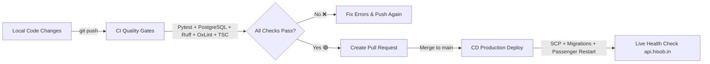

# 📖 Hissob ERP — CI/CD & Developer Workflow Guide

Welcome to the **Hissob ERP** Continuous Integration and Continuous Deployment (CI/CD) workflow guide. This document explains how developers should make changes, run local tests, push code, and leverage GitHub Actions for automated quality gates and live production deployment.

---

## 🏗️ Architecture Overview

Hissob ERP uses a 3-tier GitHub Actions pipeline:



1. **`ci.yml` (Quality Gates)**: Triggered on every branch push & PR. Spins up PostgreSQL 16, runs 19 Pytest integration tests, Ruff linter, TypeScript typecheck, and Vite production build.
2. **`deploy.yml` (Production Deployment)**: Triggered on merge to `main` (or manual trigger). Performs smart path-filtered deployment to WebHostMost cPanel server, runs database migrations, triggers Passenger restart, and verifies `/health`.
3. **`security.yml` (Weekly Audit)**: Triggered every Monday at 06:00 IST. Performs `pip-audit`, `npm audit`, Gitleaks secret scanning, and GitHub CodeQL static analysis.

---

## 🔄 Day-to-Day Developer Workflow (Step-by-Step)

### Step 1: Create a Feature/Fix Branch

Never commit directly to `main`. Always create a descriptive branch:

```bash
# 1. Fetch latest changes from main
git checkout main
git pull origin main

# 2. Create and switch to a new working branch
git checkout -b feature/add-donor-export
# or for bug fixes:
git checkout -b fix/settlement-rejection-status
```

---

### Step 2: Make Code Changes & Test Locally

Before pushing your changes, run local linters and tests to catch issues early.

#### 🐍 Backend (Python / FastAPI) Verification:

```bash
cd backend

# 1. Run Ruff linter (checks for syntax, imports, formatting)
uv run ruff check app/

# 2. Auto-fix simple formatting issues if any:
uv run ruff check app/ --fix

# 3. Run full backend unit & integration test suite
uv run python -m pytest tests/ -v
```

#### ⚛️ Frontend (React / TypeScript) Verification:

```bash
cd frontend

# 1. Run TypeScript type-check (verify no prop/type mismatch)
node "node_modules/typescript/bin/tsc" --noEmit

# 2. Run OxLint linter
npm run lint

# 3. Verify production build succeeds
npm run build
```

---

### Step 3: Commit & Push Changes

Once local checks pass cleanly:

```bash
# Stage changed files
git add .

# Commit with a clear, descriptive message
git commit -m "feat(donors): add CSV export feature for donor list"

# Push branch to GitHub
git push origin feature/add-donor-export
```

---

### Step 4: Automated CI Quality Gate Evaluation

As soon as you push your branch:

1. Go to **[GitHub Actions Tab](https://github.com/mayurpatil-in/Hissob-app/actions)**.
2. Watch the **`CI — Quality Gates`** workflow run.
3. If it shows 🟢 **Green**, both backend (Python 3.12 + PostgreSQL) and frontend (Node 22 + Vite) passed.
4. If it shows 🔴 **Red**, click the failed job to view error logs, fix the issue locally, and push again.

---

### Step 5: Create Pull Request & Deploy to Production

1. Open **[GitHub Pull Requests](https://github.com/mayurpatil-in/Hissob-app/pulls)**.
2. Click **New Pull Request** and select your branch (`feature/add-donor-export` -> `main`).
3. Fill out the PR checklist (template is automatically loaded).
4. Click **Merge Pull Request**.

#### 🚀 What happens automatically on Merge to `main`:
* **`deploy.yml`** triggers immediately.
* **Path-based Deployment**: If only `frontend/` changed, backend deployment is skipped (and vice versa).
* Backend files uploaded via SCP -> Alembic migrations executed -> Passenger restarted.
* Frontend static bundle uploaded & extracted into `public_html/`.
* Automated Health Check verifies `https://api.hisob.in/health` returns `200 OK`.

---

## ⚡ Command Cheat-Sheet

| Action | Command | Working Dir |
| :--- | :--- | :--- |
| **Start Backend Dev Server** | `uvicorn app.main:app --reload` | `backend/` |
| **Start Frontend Dev Server** | `npm run dev` | `frontend/` |
| **Run Pytest Test Suite** | `uv run python -m pytest tests/` | `backend/` |
| **Run Ruff Code Linter** | `uv run ruff check app/` | `backend/` |
| **Run TypeScript Type Check** | `node "node_modules/typescript/bin/tsc" --noEmit` | `frontend/` |
| **Run Frontend Production Build** | `npm run build` | `frontend/` |
| **Create DB Migration** | `alembic revision --autogenerate -m "description"` | `backend/` |
| **Apply DB Migrations** | `alembic upgrade head` | `backend/` |

---

## 🔒 GitHub Secrets Reference

Ensure these secrets are set under **GitHub Repository Settings -> Secrets -> Actions**:

| Secret Name | Description | Example |
| :--- | :--- | :--- |
| `SSH_HOST` | WebHostMost Server Host | `server3.webhostmost.com` |
| `SSH_USER` | cPanel SSH Username | `qhmwlequ` |
| `SSH_PASSWORD` | cPanel Account Password | `YourPassword` |
| `SSH_PORT` | SSH Port Number | `2323` |
| `VITE_API_BASE_URL` | Production Backend API URL | `https://api.hisob.in/api/v1` |

---

*Guide Version: 1.0.0 | Last Updated: August 2026*
